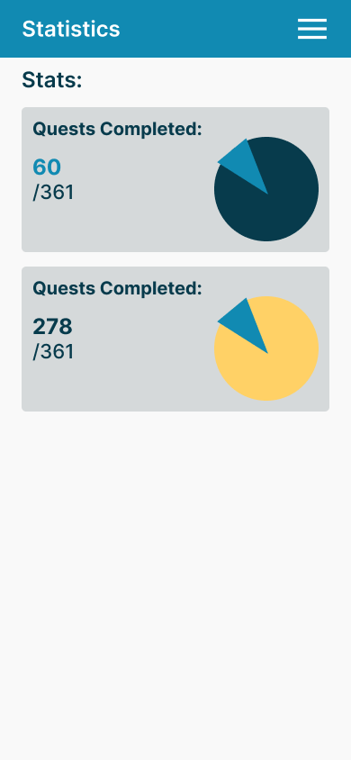
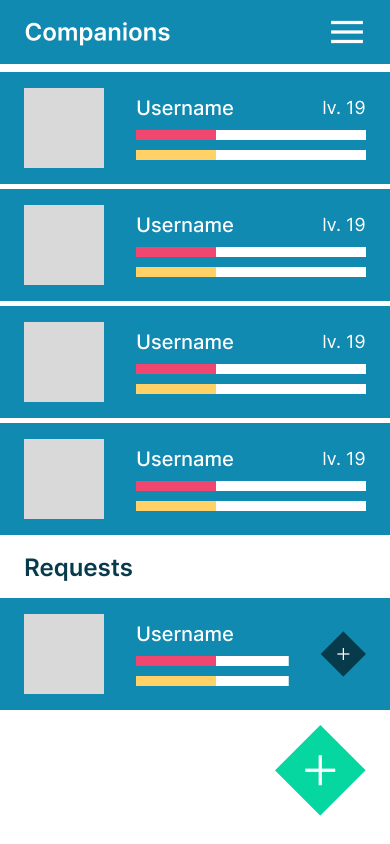

<div align="center">

> Hello world! This is the project’s summary that describes the project plain and simple, limited to the space available. 

**[PROJECT PHILOSOPHY](https://github.com/julescript/well_app#-project-philosophy) • [WIREFRAMES](https://github.com/julescript/well_app#-wireframes) • [TECH STACK](https://github.com/julescript/well_app#-tech-stack) • [IMPLEMENTATION](https://github.com/julescript/well_app#-impplementation) • [HOW TO RUN?](https://github.com/julescript/well_app#-how-to-run)**

</div>

<br><br>


> Boring Quest is task managment app with a game theme. In our modern day society people invest most of their time into non-productive activities such as gaming instead of completing their tasks. We can conclude that people are motivated to invest their time in activities that offer a fun reward system.
> The reward system in Boring Quest is simple:
   - You complete tasks and earn points.
   - You fail tasks and lose points.
> Some additional features in Boring Quest are:
   - Productivity tracking
   - Being able to create guilds and assign tasks to other users
   
### User Stories
- As a user, I want to make tasks more fun, so that I can be more motivated to finish them
- As a user, I want to automate reoccuring tasks, so that I can save time
- As a user, I want to visualize my productivity times, so that I can find the best time to start a task
- As a user, I want to be able to add friends, so that I can assign them tasks

<br><br>


> This design was planned before on paper, then moved to Figma app for the fine details.
Note that i didn't use any styling library or theme, all from scratch and using pure css modules

| Main  | Add Quest | Add Adventure  |
| -----------------| ----- | ----- |
|  |  |  |

<!-- | Statistics  | Companions  |
| ----------------- | ----- |
|  |  | -->


<br><br>


Here's a brief high-level overview of the tech stack the Well app uses:

- This project uses the [Flutter app development framework](https://flutter.dev/). Flutter is a cross-platform hybrid app development platform which allows us to use a single codebase for apps on mobile, desktop, and the web.
- For persistent storage (database), the app uses the [Hive](https://hivedb.dev/) package which allows the app to create a custom storage schema and save it to a local database.
- To send local push notifications, the app uses the [flutter_local_notifications](https://pub.dev/packages/flutter_local_notifications) package which supports Android, iOS, and macOS.
  - 🚨 Currently, notifications aren't working on macOS. This is a known issue that we are working to resolve!
- The app uses the font ["Work Sans"](https://fonts.google.com/specimen/Work+Sans) as its main font, and the design of the app adheres to the material design guidelines.


<br><br>


> Uing the above mentioned tech stacks and the wireframes build with figma from the user sotries we have, the implementation of the app is shown as below, these are screenshots from the real app

| Landing  | Home/Search  |
| -----------------| -----|
|  |  |


<br><br>


> This is an example of how you may give instructions on setting up your project locally.
To get a local copy up and running follow these simple example steps.

### Prerequisites

This is an example of how to list things you need to use the software and how to install them.
* npm
  ```sh
  npm install npm@latest -g
  ```

### Installation

_Below is an example of how you can instruct your audience on installing and setting up your app. This template doesn't rely on any external dependencies or services._

1. Get a free API Key at [https://example.com](https://example.com)
2. Clone the repo
   ```sh
   git clone https://github.com/your_username_/Project-Name.git
   ```
3. Install NPM packages
   ```sh
   npm install
   ```
4. Enter your API in `config.js`
   ```js
   const API_KEY = 'ENTER YOUR API';
   ```
