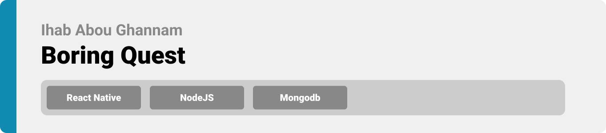
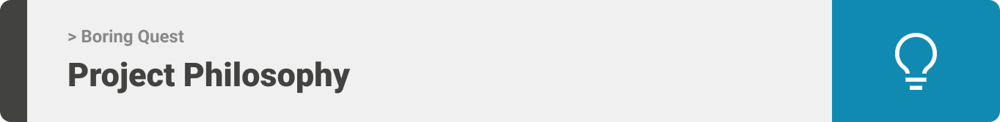
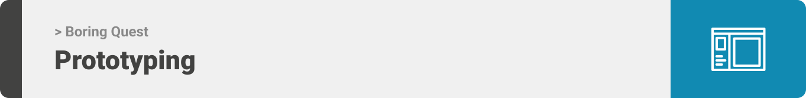
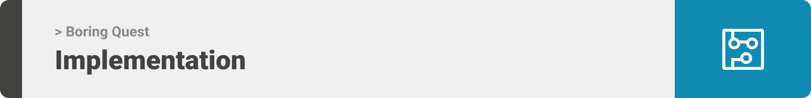

<div align="center">

> Hello world! This is the project’s summary that describes the project plain and simple, limited to the space available. 

**[PROJECT PHILOSOPHY](https://github.com/ihab-ag/boring-quest#-project-philosophy) • [WIREFRAMES](https://github.com/ihab-ag/boring-quest#-wireframes) • [TECH STACK](https://github.com/ihab-ag/boring-quest#-tech-stack) • [IMPLEMENTATION](https://github.com/ihab-ag/boring-quest#-impplementation) • [HOW TO RUN?](https://github.com/ihab-ag/boring-quest#-how-to-run)**

</div>

<br><br>




> Boring Quest is task managment app with a game theme. In our modern day society people invest most of their time into non-productive activities such as gaming instead of completing their tasks. We can conclude that people are motivated to invest their time in activities that offer a fun reward system.
> The reward system in Boring Quest is simple:
   - You complete tasks and earn points.
   - You fail tasks and lose points.
> Some additional features in Boring Quest are:
   - Productivity tracking
   - Being able to create guilds and assign tasks to other users
   
### User Stories
- As a user, I want to make tasks more fun, so that I can be more motivated to finish them
- As a user, I want to automate reoccuring tasks, so that I can save time
- As a user, I want to visualize my productivity times, so that I can find the best time to start a task
- As a user, I want to be able to add friends, so that I can assign them tasks

<br><br>



> This design was planned before on paper, then moved to Figma app for the fine details.
Note that i didn't use any styling library or theme, all from scratch and using pure css modules

| Main  | Add Quest | Add Adventure  |
| -----------------| ----- | ----- |
|  |  |  |

<br><br>


Here's a brief high-level overview of the tech stack the Well app uses:

- This project uses the [React Native app development framework](https://reactnative.dev/). React native is used for building native apps using React. It can be used to develop applications that target anything from Android, iOS devices to Windows systems.
- For storage (database), the app uses the Mongodb(https://www.mongodb.com/) package which allows for fast and easy access to data.
- To send local push notifications, the app uses [expo-notifications](https://docs.expo.dev/versions/latest/sdk/notifications) package which supports Android, iOS.
- The app uses a simple and fun design aimed to give the user an easy to use app while maintaing a game theme.


<br><br>


> Uing the above mentioned tech stacks and the wireframes build with figma from the user sotries we have, the implementation of the app is shown as below, these are screenshots from the real app

| Main  | Add Quest | Add Adventure  |
| -----------------| ----- | ----- |
|  |  |  |

| Adventure & Quest Pages  | Login |
| -----------------| ----- |
|  |  |

| Statistics  | Companions |
| -----------------| ----- |
|  |  |

| Landing page  | 
| -----------------| 
|  |

<br><br>


> This is an example of how you may give instructions on setting up your project locally.
To get a local copy up and running follow these simple example steps.

### Prerequisites

This is an example of how to list things you need to use the software and how to install them.
* npm
  ```sh
  npm install npm@latest -g
  ```

* expo cli
  ```sh
  npm install -g expo-cli
  ```

### Installation & Setup

1. Clone the repo
   ```sh
   git clone https://github.com/ihab-ag/boring-quest.git
   ```
2. Install NPM packages for server
   ```sh
   cd server
   npm install
   ```
3. Create and setup '.env' file
   ```sh
   PORT = '[Your port]'

   DB_URL= '[Your mongodb url]'

   JWT_SECRET_KEY= '[Your jwt secret key]'
   ```
4. Install NPM packages for frontend
   ```sh
   cd frontend
   npm install
   ```
5. Connect app to server
   ```js
   cd frontend/src/apis/configs/axios.config.js
   change the 'BASE_URL' to your server IPv4 with the port
   (Be sure to be connected to the same network) 
   ```
- 🚨 Due to circumstances this app has only been tested on android, so for the best experience it is the recomended OS
